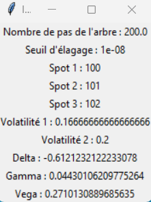

# **TreeNomial**

**Author :** Hugo Soleau

## **Summary**

**Presentation of TreeNomial**..........................................................................................................................................p.1   
**Installation Guide**...............................................................................................................................................................p.1  
**User Guide**..............................................................................................................................................................................p.2

## **Presentation of TreeNomial**

TreeNomial is an application designed to price an option by constructing a trinomial tree and calculating the Greeks $\Delta$, $\Gamma$, $\upsilon$ associated with this option.

Below we provide a table of the different features of our application.

| Feature | Status | Measures |
|---------|--------|----------|
| Pricing beyond 1000 steps  | Functional   | Up to a minimum of 2500 steps |
| Performance   | Functional   | ~0.1s (for 100 steps Python)   |
| Pruning   | Functional   | R.A.M.   |
|Calculating Greeks| Functional | Difficulties beyond 1000 steps for executable management but up to 2500 steps minimum otherwise|
|||

## **Installation Guide**

1. Extract the files from the compressed TreeNomial folder.

2. Open **python_path.txt** and indicate the path to your python executable (i.e., to the python.exe file).

3. Click on **TreeNomial.exe** (if the process fails, simply click on TreeNomial.bat)

  

**Note:** The executable is linked to the used version of python and to the machine environment on which it is executed. Therefore, it may happen that following an OS or python update, it no longer executes or only partially executes. It is then necessary to run the .bat file.

## **User Guide**

1. Then choose what you want to do: calculate pricing by trinomial tree or calculate the implemented Greeks (note: you can click on both simultaneously, but the trinomial tree calculation will be performed first).

  

2. Choose whether you want to enter the parameters related to your calculations or if you want to use the parameters initially set by the developer.

  

  

**Note:** You can enter formulas for numerical values such as fractions. These will be evaluated by the software. However, the program does not evaluate symbols like "%".

  

**Note:** For dates, enter the year, month, and day in each box. Be careful not to enter a value in the form "0x" with x being any digit. In this case, the program will stop.

  

3. Choose whether the tree or trees to be built will employ pruning. If so, enter the pruning threshold.

  

**Note:** Here too, the threshold can be entered as a formula.

  

4. Choose whether you wish to search for the list of negative probabilities that appear during tree construction. However, if you do, the program will necessarily take longer to execute.
   

  

5. Once the calculations are completed, a window opens indicating the results. You can close it and choose to repeat your calculations for the selected option.

  

  

6. To calculate the Greeks, the first steps are the same as for the tree until the selection of the Greeks you want to calculate.

  

7. Depending on what you choose, different windows will open. If you have selected delta and not gamma, it is not necessary to enter the 3rd spot value since it will not be used. Conversely, it is important to note that for the consistency of the calculations, it is necessary that the three entered spots have the same difference between them.

  

  

8. Finally, you will receive a summary of the results for the selected parameters and options. When closing the window, you will be offered the option to recalculate the Greeks and you will be able to select different Greeks than those previously chosen.

  

**Note:** The program uses a file that keeps in memory the last entered parameters and their values. Therefore, you can at any time rerun a task with the same values as before in case a window is closed too quickly. This also allows for faster data entry during tests with parameters that change very little, as well as to manually access the parameters to see what the last user entered.